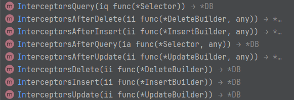

## leopards 

An ORM for Goer, forking from facebook's `ent` framework.


## leopards cli command

```shell
go install github.com/liqiongfan/leopards/cmd/leopards@latest
```

:::tips
Table struct and table name should be maintained by leopards.
:::


```Open title="leopards"

	db, err := leopards.OpenOptions{
		User:     "用户名",
		Password: "密码",
		Host:     "账号",
		Port:     "3306",
		Database: "数据库名",
		Debug:    true, // 是否开启调试，开启调试会输出SQL到标准输出
		Dialect:  leopards.MySQL,
	}.Open()

```


### 中间件




+ InterceptorsQuery 添加一个前置查询中间件
+ InterceptorsAfterQuery 添加一个后置查询中间件
+ InterceptorsInsert 添加一个前置插入中间件
+ InterceptorsAfterInsert 添加一个后置插入中间件
+ InterceptorsUpdate 添加一个前置更新中间件
+ InterceptorsAfterUpdate 添加一个后置更新中间件
+ InterceptorsDelete 添加一个前置删除中间件
+ InterceptorsAfterDelete 添加一个后置删除中间件


### 增删改查

+ Query  查询
+ Update 更新
+ Insert 插入
+ Delete 删除


### 实例

```go title="leopards"
dest := make([]User, 0, 30)
err := db.Query().Select(`id`, `count(*) as count`).From(`user`).Scan(context.TODO(), &dest)
for _, user := range dest {
	println("用户ID: ", user.Id, " 姓名: ", user.Name)
}
```


### 内嵌结构体非指针

```go title="leopards"

type User struct {
	Id int `json:"id"`
	Name string `json:"name"`
	Address string `json:"address"`
	CreatedAt time.Time `json:"created_at"`
	UpdatedAt time.Time `json:"updated_at"`
}

type UserCount struct {
	User // 内嵌结构体 leopards 支持赋值，不限制层级，不能使用指针类型，限制结构体
	Count int `json:"count"`
}

out := make([]UserCount, 0, 15)
err = db.Query().
    Select(`*`, `count(*) as count`).
    From(`users`).
    GroupBy(`id`).
    Scan(ctx, &out)
if err != nil {
    panic(err)
}

```

:::warning

```go title="错误写法"
type UserCount struct {
    *User
}
```

:::


